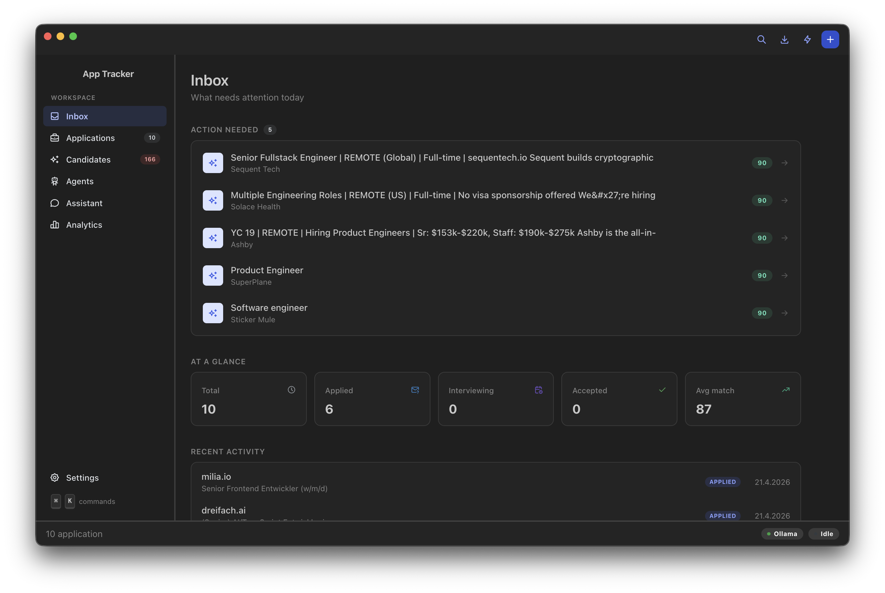
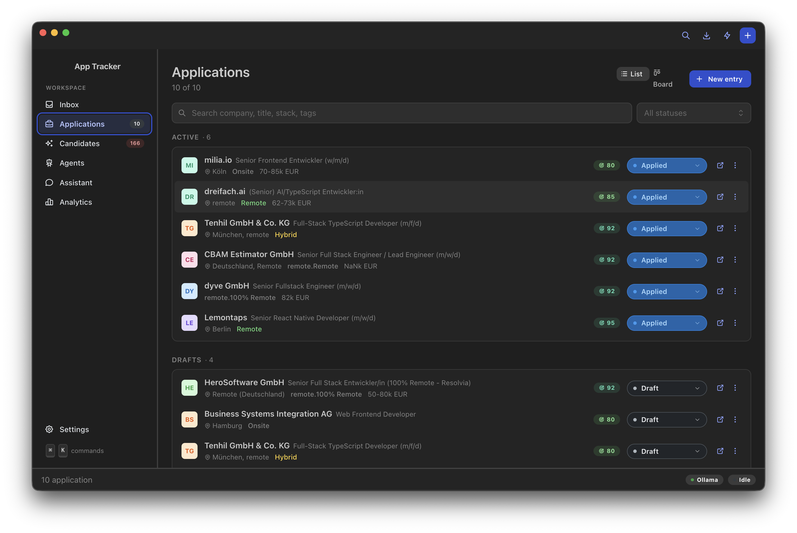
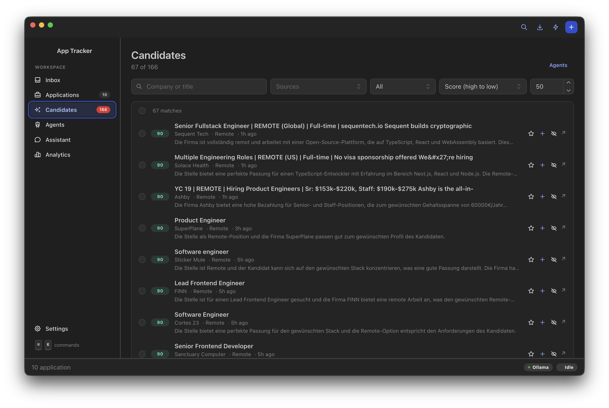
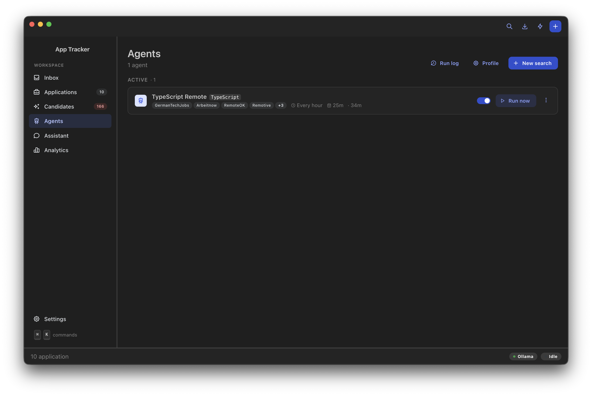
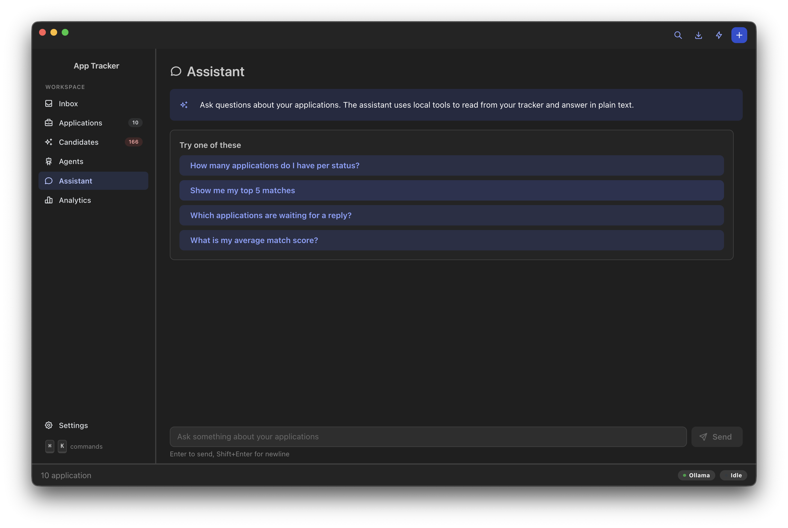
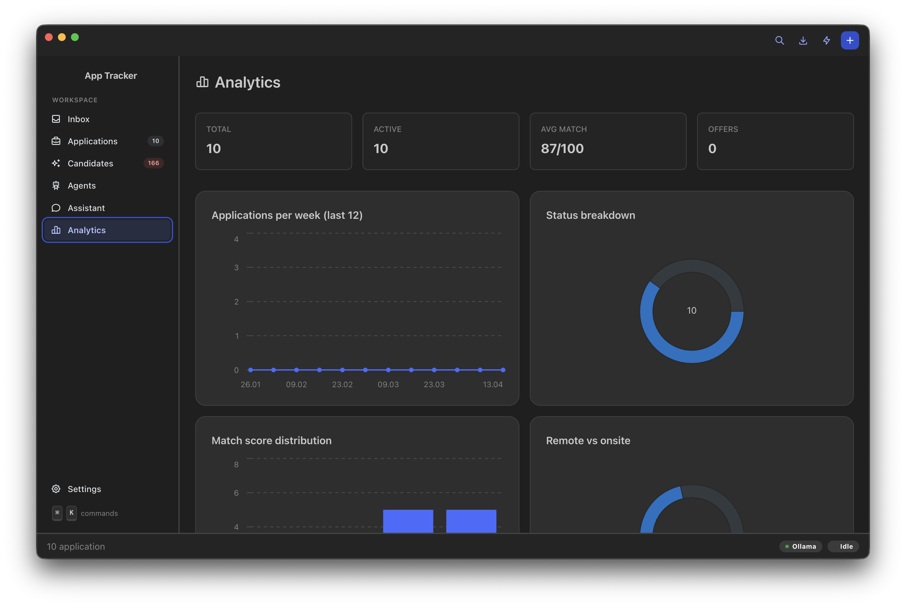

# Pitch Tracker

Offline desktop app for tracking job applications. No cloud, no login, all data stays local. Includes local LLM integration for auto-fill from URLs, fit scoring against your own profile, background search agents across multiple job portals, an AI assistant that queries your data via tool-calling, email sending with your own SMTP, and analytics.




## Screenshots

| Inbox | Applications |
|---|---|
|  |  |

| Candidates feed | Agents |
|---|---|
|  |  |

| Assistant (AI chat) | Analytics |
|---|---|
|  |  |

## Features

### Tracking
- Status flow: draft, applied, in review, interview scheduled, interviewed, offer received, accepted, rejected, withdrawn
- List view + Kanban board view, grouped by stage
- Rich-text notes with formatting, headings, lists, links
- Company, title, salary range, stack, contacts, notes, tags, priority
- Requirements and benefits as multi-tag lists per application
- Interviews as a list of dated entries
- Excel export (HTML in notes is stripped for clean output)

### Local AI (optional)
- Auto-fill from a job URL using local Ollama: extracts company, title, stack, profile, benefits as JSON
- Fit-check that scores the role against your profile (0-100 plus reason)
- **Assistant page**: conversational chat with tool-calling. Ask "how many applications per status?" or "show my top 5 matches" and the AI queries your local database directly
- Model auto-unload after idle to keep CPU quiet

### Agents
- Background search agents across multiple portals:
  - GermanTechJobs (RSS, DE)
  - Remotive (API, worldwide remote)
  - Arbeitnow (API, DE/EN remote)
  - RemoteOK (API, worldwide remote)
  - We Work Remotely (RSS)
  - HackerNews Who is Hiring
  - Indeed DE (RSS, experimental)
  - Single URL
- Multi-select sources per search, configurable interval (manual, hourly, 3h, 6h, 12h, daily)
- LLM-powered scoring of each candidate against your profile
- Auto-import threshold to pull high-score matches straight into your applications
- Bulk actions, favorites, candidate age, per-run log
- Deduplication across sources

### Email
- Send applications by email with your own SMTP (Gmail, Outlook, your own host)
- **SMTP password encrypted via OS keychain** (Electron safeStorage: macOS Keychain, Windows DPAPI, Linux libsecret). The repo being public is fine, nothing in the code can decrypt it - only your logged-in OS session can
- Attach your CV automatically (stored inside app data, not just a path reference)
- Templated body with `{{company}}`, `{{jobTitle}}`, `{{contactName}}`, `{{name}}`, `{{signature}}` variables pre-filled from your profile

### Analytics
- KPI tiles: total, active, average match, offers
- Applications per week (last 12)
- Status breakdown donut
- Match-score distribution
- Remote vs on-site donut

### Backup and restore
- One-click ZIP backup of all data (applications, agents, profile, CV, config)
- Restore overwrites current data from a backup ZIP

### UX
- Tray icon with quick-add and latest candidates
- Right-side drawer UI instead of modals
- Light, dark and system theme
- Command Palette (Cmd+K) with all navigation and actions
- Keyboard: Cmd+N (new), Cmd+Shift+N (quick-add from clipboard), Cmd+F (search), Cmd+E (export), Cmd+, (settings), Cmd+S (save in form)
- English and German language
- Follow-up notifications after 7+ days without status update
- Auto-updates via GitHub Releases (electron-updater)
- 100% offline: SQLite in platform user-data folder

## Install

### Prebuilt binaries

Releases: https://github.com/unfloned/pitch-tracker/releases

- macOS: download the `.dmg`, open, drag the app into Applications
- Windows: download the `.exe` installer and run it
- Linux: download the `.AppImage` (or `.deb`) and run it

### From source

```bash
git clone https://github.com/unfloned/pitch-tracker.git
cd pitch-tracker
npm install
npm run dev
```

## LLM setup (for auto-fill, fit check, agent scoring, assistant)

The app is fully usable without an LLM - auto-fill, fit check, agent scoring and the Assistant page just won't work. Ollama is called over HTTP on your machine.

```bash
brew install ollama            # macOS
# or download the desktop app from https://ollama.com/download

ollama pull llama3.2:3b        # recommended: fast, low CPU load, supports tool-calling
# or qwen2.5:7b-instruct       # higher quality but heavier
```

In the app settings: check status, optionally click "Start Ollama" and "Download model".

## Stack

- Electron 33 with electron-vite
- React 18 with Mantine 7 for UI
- React Router for navigation
- Mantine Tiptap for rich-text notes
- Mantine Charts + recharts for analytics
- i18next for multi-language
- better-sqlite3 for local storage
- @deepkit/type for type definitions
- exceljs for Excel export
- nodemailer for SMTP
- adm-zip for backups
- Electron safeStorage for credential encryption
- electron-updater against GitHub Releases
- Ollama HTTP API for local LLM (chat + tool-calling)
- Vitest for unit tests

## Architecture

```
src/
  shared/               Type definitions + pure utilities (html strip)
  main/                 Electron main process
    index.ts            Window and tray
    db.ts               SQLite CRUD + legacy data migration
    llm.ts              Ollama client (extract, assessFit, status, start)
    chat.ts             Ollama chat with tool-calling (assistant)
    agents/             Scrapers, scorer, scheduler
    email.ts            SMTP send + verify
    backup.ts           ZIP create/restore
    profile.ts          User profile + safeStorage-encrypted SMTP password
    updater.ts          electron-updater wiring against GitHub
    reminders.ts        Follow-up notifications
    ipc.ts              IPC handlers
    export.ts           Excel export
  preload/              contextBridge API
  renderer/             React UI with Mantine
    i18n/               English and German translations
    App.tsx             AppShell with routing
    pages/              Dashboard, Applications, Candidates, Agents, Chat, Analytics, Settings
    components/         Drawers, Lists, Board, Sidebar, Command Palette, Status Footer, Update Banner
tests/                  Vitest tests
```

## Build

```bash
npm test                    # run tests
npm run build               # code build
npm run package:mac         # .dmg (unsigned)
npm run package:win         # .exe (unsigned)
npm run package:linux       # .AppImage
```

## Release

Tag-based release via GitHub Actions:

```bash
git tag v0.4.0
git push origin v0.4.0
```

The release workflow builds macOS (`.dmg`), Windows (`.exe`), and Linux (`.AppImage` + `.deb`) artifacts in parallel and publishes them as a GitHub release. Release notes are extracted from the matching version section in `CHANGELOG.md`.

## Data location

SQLite databases, profile and CV file live in the platform user-data folder. On macOS this is `~/Library/Application Support/Pitch Tracker/`. The app migrates from older names (`Simple Application Tracker`, `bewerbungen-tracker`) on first launch.

## License

MIT, see `LICENSE`.
