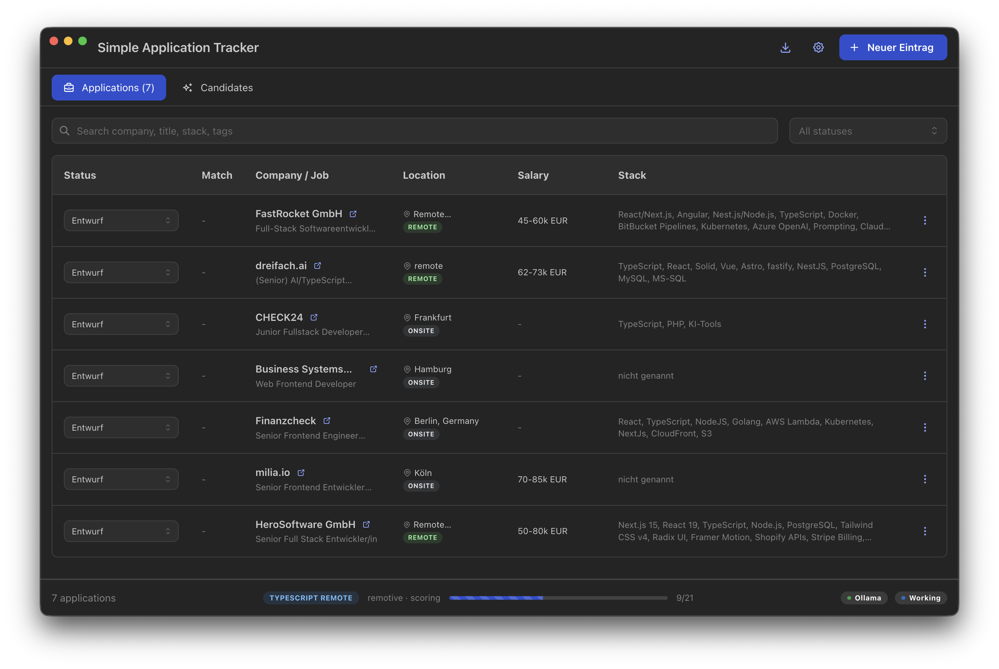
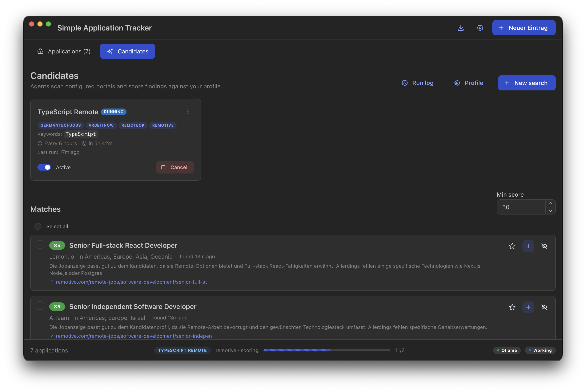
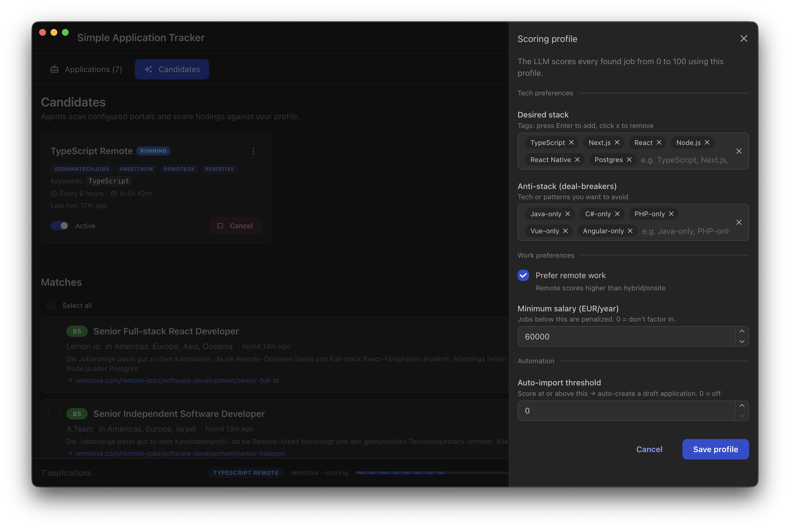
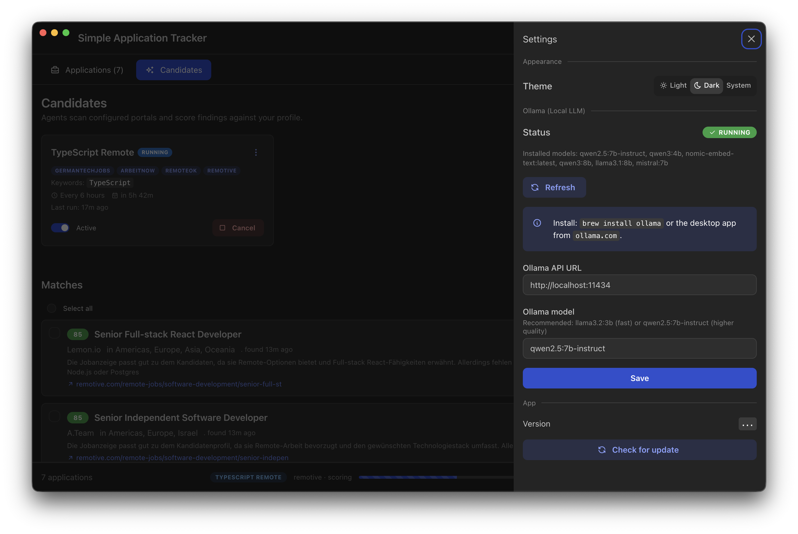

# Simple Application Tracker

Offline desktop app for tracking job applications. No cloud, no login, all data stays local. Includes local LLM integration for auto-fill from URLs, fit scoring against your own profile, and background search agents across multiple job portals.




## Screenshots

| Candidates with live agent | Scoring profile |
|---|---|
|  |  |

| Settings and Ollama status | |
|---|---|
|  | |

## Features

- Track applications with a status flow (draft, applied, in review, interview, offer, accepted, rejected)
- Store company, title, salary range, stack, contacts, notes, tags, priority
- Requirements and benefits as multi-tag lists per application
- Auto-fill from a job URL using local Ollama (extracts company, title, stack, profile, benefits as JSON)
- Fit check button that scores the role against your profile (0 to 100 plus reason)
- Agent system with configurable searches across multiple portals:
  - GermanTechJobs (RSS, DE)
  - Remotive (API, worldwide remote)
  - Arbeitnow (API, DE/EN remote)
  - RemoteOK (API, worldwide remote)
  - We Work Remotely (RSS)
  - Single URL
- Multi-select sources per search, configurable interval (manual, hourly, 3h, 6h, 12h, daily)
- LLM-powered scoring of each candidate against your profile, with auto-import for high-score matches
- Bulk actions on candidates (star, dismiss), favorites, candidate age, run log
- Live agent progress in the footer with cancel button
- Deduplication across sources (same job from RemoteOK and Remotive counts once)
- Excel export of all applications
- Tray icon with quick-add
- Right-side drawer UI instead of modals
- Light, dark and system theme
- English and German language (switcher in Settings)
- Auto-updates via GitHub Releases (electron-updater)
- 100% offline: SQLite in the platform user-data folder

## Install

### Prebuilt binaries

Releases: https://github.com/unfloned/simple-application-tracker/releases

- macOS: download the `.dmg`, open, drag the app into Applications
- Windows: download the `.exe` installer and run it
- Linux: download the `.AppImage` (or `.deb`) and run it

### From source

```bash
git clone https://github.com/unfloned/simple-application-tracker.git
cd simple-application-tracker
npm install
npm run dev
```

## LLM setup (for auto-fill, fit check and agent scoring)

The app is fully usable without an LLM. Auto-fill, fit check and agent scoring call Ollama over HTTP.

```bash
brew install ollama            # macOS
# or download the desktop app from https://ollama.com/download

ollama pull llama3.2:3b        # recommended: fast, low CPU load
# or qwen2.5:7b-instruct       # higher quality but heavier
```

In the app settings: check status, optionally click "Start Ollama" and "Download model".

## Stack

- Electron 33 with electron-vite
- React 18 with Mantine 7 for UI
- i18next for multi-language
- better-sqlite3 for local storage
- @deepkit/type for type definitions
- exceljs for Excel export
- electron-updater against GitHub Releases
- Ollama HTTP API for local LLM

## Architecture

```
src/
  shared/               Type definitions (Application, JobSearch, JobCandidate)
  main/                 Electron main process
    index.ts            Window and tray
    db.ts               SQLite CRUD
    llm.ts              Ollama client (extract, assessFit, status, start)
    agents/             Scrapers (RSS and API adapters), scorer, scheduler
    updater.ts          electron-updater wiring against GitHub
    ipc.ts              IPC handlers
    export.ts           Excel export
  preload/              contextBridge API
  renderer/             React UI with Mantine
    i18n/               English and German translations
    App.tsx             AppShell with sticky tabs and footer
    pages/              Candidates page
    components/         Drawer, List, Settings, UpdateBanner, StatusFooter
```

## Build

```bash
npm run build               # code build
npm run package:mac         # .dmg (unsigned)
npm run package:win         # .exe (unsigned)
npm run package:linux       # .AppImage
```

## Release

Tag-based release via GitHub Actions:

```bash
git tag v0.2.0
git push origin v0.2.0
```

The release workflow builds macOS (`.dmg`), Windows (`.exe`), and Linux (`.AppImage` + `.deb`) artifacts in parallel and publishes them as a GitHub release. Release notes are extracted from the matching version section in `CHANGELOG.md`.

## Data location

SQLite databases and config live in the platform user-data folder. On macOS this is `~/Library/Application Support/simple-application-tracker/`.

## Roadmap

- Mail agent over SMTP that sends applications when a job matches the profile
- Form auto-fill on job portals via a browser extension
- Kanban view in addition to the table
- Calendar integration for interviews
- JSON import and export for backup

## License

MIT, see `LICENSE`.
